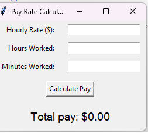

# Pay Rate Calculator GUI

This is a simple Python application with a graphical user interface (GUI) using `tkinter` to calculate total pay based on an hourly rate and the number of hours and minutes worked.

## 💡 Features

- Input hourly rate
- Input time worked (hours + minutes)
- Instant total pay calculation
- Simple, user-friendly interface

## 🖥️ Screenshot



## 🐍 Requirements

- Python 3.x  
- No external libraries required (uses built-in `tkinter`)

## ▶️ How to Run

```bash
python pay_calculator_gui.py

